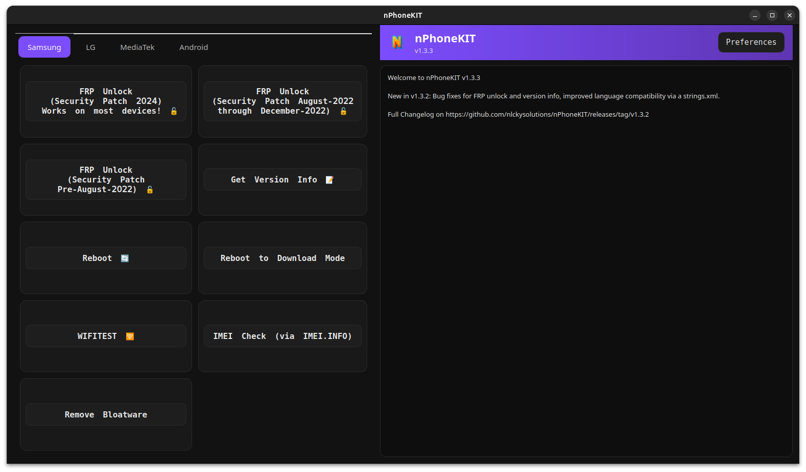

<div align="center" markdown="1">
<h1>nPhoneKIT</h1>
  


<u>**Safe, free, open-source.**</u>

[](https://python.org)
[](https://mastodon.social/@nlckysolutions)
</div>

---

# About the project

**nPhoneKIT** is a fully open-source, community-powered toolbox for Android devices, replacing certain closed-source tools that *hide* what they’re doing to your phone.

Unlike some other tools, that are obfuscated and flagged by antivirus scanners, **nPhoneKIT** is:

- ✅ 100% open Python code
- ✅ Actually shows you the commands
- ✅ Does most of the things that other tools can do anyway

### Why choose a tool that *won’t* tell you what it’s doing?
With **nPhoneKIT**, there’s no "magic click" – just real commands and real transparency. More features coming soon 👀

---

# LEGAL WARNING: THIS TOOL IS **ONLY** INTENDED FOR **RIGHTFUL OWNERS** TO UNLOCK **THEIR OWN DEVICES**. DO NOT USE THIS TOOL ON DEVICES YOU DO NOT OWN. NLCKYSOLUTIONS™ IS NOT RESPONSIBLE FOR MISUSE OF THIS TOOL, AND MISUSE IS HIGHLY PROHIBITED.

---

### Bugs
- Issues with ```sudo``` on select Linux distros
- Motorola FRP not working
- Errors on Windows

> [!IMPORTANT]
> If you find a bug, **make sure to open a GitHub issue.** This will help me fix the error and make nPhoneKIT better for everyone!

---

## Upcoming Changes (for 1.5.0)
- Better error system: Detailed, debuggable error codes
- Better Windows support
- Easier way to install, (installing by source will still be supported)

---

### Credits
- **MediaTek features work only using MTKCLIENT, which is in the DEPS folder. Sourced from: https://github.com/bkerler/mtkclient. MTKCLIENT is provided by bkerler and IS NOT owned or created by nPhoneKIT in ANY WAY.**
- **IMEI Checking features work by opening a new tab of www.imei.info in order to check your IMEI yourself.**

---

## Important Information (**READ!**)

- **Motorola FRP Fastboot unlock is EXPERIMENTAL and is not likely to work.**
- nPhoneKIT uses the same unlock methods as many other free tools, but is open-source.
- nPhoneKIT will never ask for a payment nor will it show any ads.
- nPhoneKIT was developed mostly for education by open-sourcing common unlock methods, but is also decently reliable.
- nPhoneKIT is fully FOSS and while it will not ask for a payment, donations are greatly appreciated and your GitHub username can be shown on the README.MD if you would like.
- nPhoneKIT is meant to be used responsibly by proper owners of their own phones.

## Installation

### Windows 🪟

- Go to the latest release, download Source Code as ZIP.
- Make sure you have Python and Pip installed.
- Extract the zip, open Command Prompt as Administrator, and cd into the source code directory.
- Run the following command:
  ```
  pip install pyserial requests pyqt5 && pip install -r ./deps/mtkclient/requirements.txt
  ```
- Then, (every time you want to run nPhoneKIT you will need to run this in the source folder) (before running the below command, make sure Command Prompt is started as Administrator):
  ```
  python main.py
  ```

### Linux 🐧

- Go to the latest release, download Source Code as ZIP.
- Extract the zip, open Terminal, and cd into the source code directory.
- Run the following command:
  ```
  sudo apt install python3 python3-tk python3-serial python3-requests python3-pyqt5 adb
  ```
- Then, (every time you want to run nPhoneKIT you will need to run this command in the source folder) (make sure to use SUDO):
  ```
  sudo python3 main.py
  ```

  ## ⚠️ IMPORTANT! If you want MediaTek features on LINUX:
  - In order to enable MTKCLIENT features, please run these additional commands in the source folder which contains main.py.
    ```
    sudo python3 -m venv ./deps/venv
    sudo bash -c 'source ./deps/venv/bin/activate && pip install -r ./deps/mtkclient/requirements.txt'
    ```

    **These commands are REQUIRED on Linux in order to enable ANY MTKCLIENT features. Otherwise, MTKCLIENT simply will not open from nPhoneKIT.**

---

## 📱 Current Features

### Samsung
- FRP Unlock on most U.S. 2024 Samsung Devices 
- FRP Unlock on Aug 2022 - Dec 2022 Security Patch Date Samsung Devices
- FRP Unlock on Pre - Aug 2022 Security Patch Date Samsung Devices
- Get Version/Firmware Info on All Samsung Devices
- Reboot Samsung Devices (Normal or into Download Mode)
- Open Hidden WLANTEST Menu on All Samsung Devices
- IMEI Check Feature
- Remove Bloatware
    
### LG
- Legacy Screen Unlock (Pre-G5)

### Mediatek
- MTK Client (by [@bkerler](https://github.com/bkerler/mtkclient))

### Generic Android
- Reboot

---

## ⚠️⚠️⚠️ Important Notes

- **nPhoneKIT has a feature called "Success Checks" which will contact external servers, telling them whether a said feature worked on your phone model. No personal data is sent. This helps improve nPhoneKIT. (You may inspect the full success check code if you would like, this is only used to improve and debug. Personal identifiers are anonymized, hashed, and made untraceable)**

---

### ⚖️ Legal

<sub>nPhoneKIT is a tool built entirely from original Python code. It does not include, link to, or distribute any copyrighted firmware, exploits, or proprietary binaries. Any similarity in function to other tools is the result of using standard public command sets (e.g. ADB, AT). This project is not affiliated with or endorsed by Samsung, LG, Google, Wireshark, or SamFW Tool. Trademarks used for descriptive purposes only.</sub>

---
